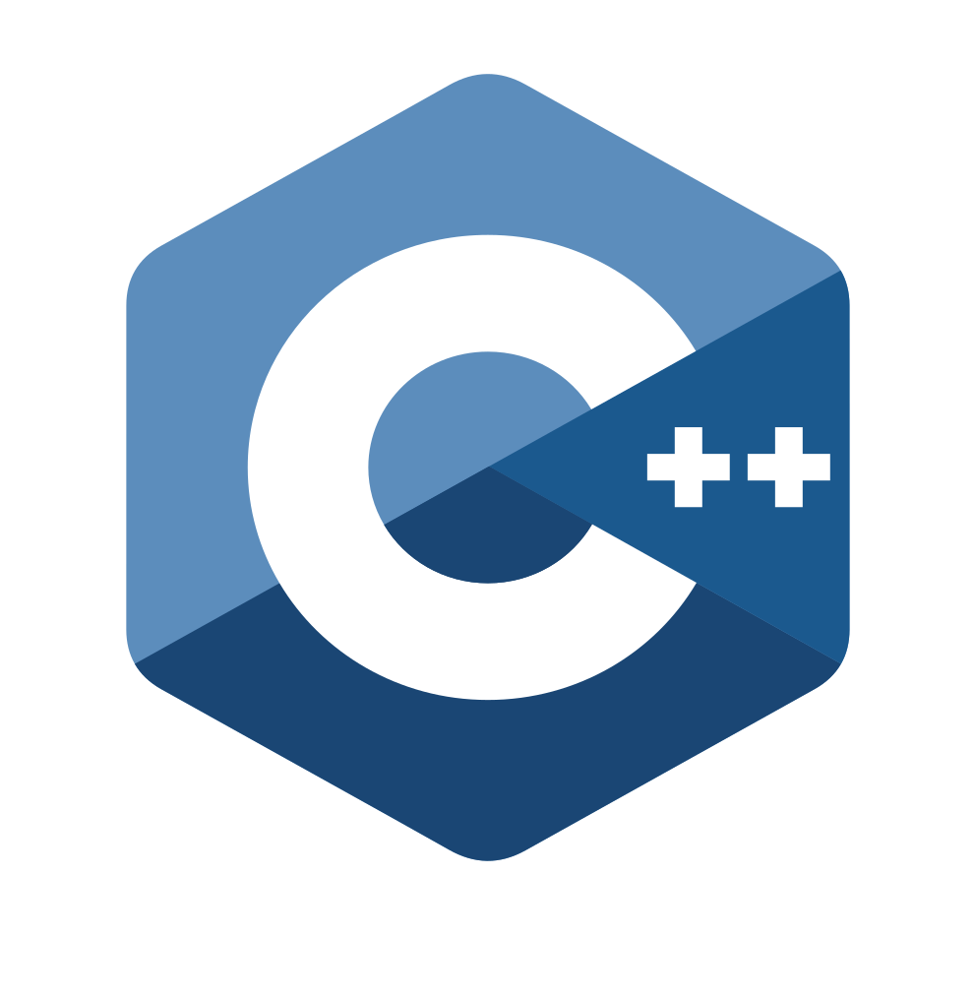

#   learn CPP

### Abstract
The inspiration to create this repository comes from a keen interest in practical life problem solving. There are many programming languages other then CPP which can be used. In my first year I have studied C programming, it is a high level language with great speeds but, lacks Object Oriented Programming, and OOP is very useful is code reuseability and proper structuring of code. Python could also be a great alternative, but when it comes up to high speed and memory management applications CPP is a better choice.  

### Flow of Code and Source for Question practice:

I am following CPP at Apna College. Reference: https://youtube.com/playlist?list=PLfqMhTWNBTe0b2nM6JHVCnAkhQRGiZMSJ. And I have written all the programs I practiced while learning CPP.
Reference for Practice:https://www.hackerrank.com/domains/cpp

### What next?

I am looking forward to work on a project in CPP, and possibly involving use of microcontroller(Arduino Uno).
Also looking forward for Internship in the domain of software development for electronics using CPP.
After Gaining enough experience in CPP, Next step to learn would be Python programming for practical problem solving.
    
### Contact

email: mailtovigyannveshi@gmail.com
linkedIn:https://www.linkedin.com/in/rudraksha-bandodkar-4b4a35221/